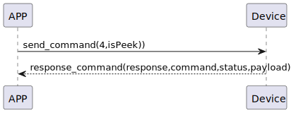

# History 履歴

### 送信フォーマット
| Byte | 1 | 0 |
|:------:|:------:|:------:|
| Data | isPeek|  command |
- command:命令4(固定)
- isPeek:true(最新の履歴を取得し、履歴を削除しない) 、false(過去の履歴を取得し、履歴を削除する)

## 受信フォーマット
| Byte | N~3 | 2 | 1 | 0 |
|:------:|:------:|:------:|:------:|:------:|
| Data | payload | status | command | response  |
- command:命令4(固定)
- response:応答0x07(固定)
- status:状態0x00(成功) 状態0x05(履歴なし) 
- payload:下記を参考する  payload
#### payload

| Byte | N~16 | 15~9 | 8~5 | 4 | 3~0|
|:------:|:------:|:------:|:------:|:------:|:------:|
| Data | history | mech_status | ts | type | id |

- history:履歴
- mech_status:機械状態
- ts:timestamp
- type:履歴タイプ
- id:第何章の履歴 
##### history 

| Byte | 32~1 | 0 |
|:----:|:---:|:---:|
| Data | history_data | history_length |


- history_length:履歴の長さ
- history_data:履歴のデータ

## フローチャート
<!--  -->


## android示例
``` java
      private fun readHistoryCommand(result: CHResult<CHEmpty>) {
        if (checkBle(result)) return

        sendEncryptCommand(SSM2Payload(SSM2OpCode.read, SesameItemCode.history, if (isInternetAvailable()) byteArrayOf(0x01) else byteArrayOf(0x00))) { res ->
            if (res.cmdResultCode == SesameResultCode.success.value) {
                if (isInternetAvailable()) {
//                    L.d("hcia", "deviceId.toString().uppercase():" + deviceId.toString().uppercase())
                    CHAccountManager.postSS2History(deviceId.toString().uppercase(), res.payload.toHexString()) {}
                }
                val recordId = res.payload.sliceArray(0..3).toBigLong().toInt()
                var historyType = Sesame2HistoryTypeEnum.getByValue(res.payload[4]) ?: Sesame2HistoryTypeEnum.NONE
                val newTime = res.payload.sliceArray(5..12).toBigLong() //4
//                L.d("hcia", "newTime:" + newTime)
                val historyContent = res.payload.sliceArray(13..res.payload.count() - 1)

                if (historyType == Sesame2HistoryTypeEnum.BLE_LOCK) {
                    val payload22 = historyContent.sliceArray(18..39)
                    val locktype = payload22[0] / 30
                    if (locktype == 1) {
                        historyType = Sesame2HistoryTypeEnum.WEB_LOCK
                    }
                    if (locktype == 2) {
                        historyType = Sesame2HistoryTypeEnum.WEB_LOCK
                    }
                    historyContent[18] = (payload22[0] % 30).toByte()

                }
                if (historyType == Sesame2HistoryTypeEnum.BLE_UNLOCK) {
                    val payload22 = historyContent.sliceArray(18..39)
                    val locktype = payload22[0] / 30
                    if (locktype == 1) {
                        historyType = Sesame2HistoryTypeEnum.WEB_UNLOCK
                    }
                    if (locktype == 2) {
                        historyType = Sesame2HistoryTypeEnum.WEB_UNLOCK
                    }
                    historyContent[18] = (payload22[0] % 30).toByte()
                }

                val chHistoryEvent: CHHistoryEvent = parseHistoryContent(historyType, historyContent, newTime, recordId)
                val historyEventToUpload: ArrayList<CHHistoryEvent> = ArrayList()

                historyEventToUpload.add(chHistoryEvent)
                val chHistorysToUI = ArrayList<CHSesame2History>()
                historyEventToUpload.forEach {
                    val ss2historyType = Sesame2HistoryTypeEnum.getByValue(it.type) ?: Sesame2HistoryTypeEnum.NONE
                    val ts = it.timeStamp
                    val recordID = it.recordID
                    val histag = it.historyTag?.base64decodeByteArray()
//                    val params = it.parameter?.base64decodeByteArray()
                    val tmphis = eventToHistory(ss2historyType, ts, recordID, histag)
                    if (tmphis != null) {
                        chHistorysToUI.add(tmphis)
//                        L.d("hcia", "tmphis:" + tmphis.date +" "+ tmphis.recordID)
                    }
                }

                historyCallback?.invoke(Result.success(CHResultState.CHResultStateBLE(Pair(chHistorysToUI.toList(), null))))
                if (isInternetAvailable()) {
                    this.readHistoryCommand {}
                }
            } else {
                historyCallback?.invoke(Result.failure(NSError(res.cmdResultCode.toString(), "CBCentralManager", res.cmdResultCode.toInt())))
            }
        }
    }

```
