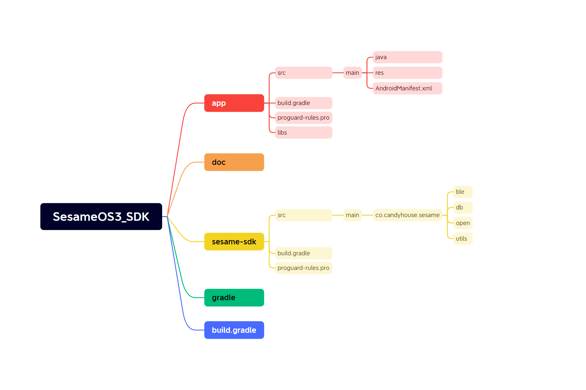

# Android プロジェクトのコード例

<!--  -->
以下は一般的な Android プロジェクトの構造例で、コードとリソースファイルを整理するために使用されます。

主なプロジェクトの構造は次の通りです：
- `libs/`：サードパーティのライブラリのバイナリファイルを保存するためのフォルダ（.jar、.aar など）です。

- `java/`：Java コードを保存します。機能モジュールによってサブパッケージが分けられます。例えば `activities/` はアクティビティクラスを、`adapters/` はアダプタークラスを保存します。

- `res/`：リソースファイルを保存し、レイアウトファイル、文字列、アイコンなどが含まれます。リソースの種類によってディレクトリごとに保存します。例えば `layout/` はレイアウトファイルを、`drawable/` は画像リソースを、`values/` は文字列やスタイルのリソースを保存します。

- `build.gradle`：応用レベルの Gradle 設定ファイルで、依存関係、プラグイン、ビルド設定を構成するために使用されます。

- `proguard-rules.pro`：ProGuard 設定ファイルで、コードの難読化と最適化を行うために使用されます。これはオプションで、リリースバージョンの場合に適用されます。
- co.candyhouse.sesame.ble: 主にos2、os3のBleデバイスの接続と機能を保存します。 
- co.candyhouse.sesame.db: ローカルストレージに保存します。 
- co.candyhouse.sesame.open: Bleデバイスの管理、設定、パラメータを保存します。
- co.candyhouse.sesame.utils: Ble転送の暗号化アルゴリズムやログの記録を保存します。

