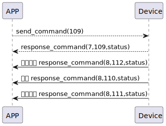

# Card Get 説明
携帯電話で命令109を送信し、カードの情報を取得します。
### 送信フォーマット

|  Byte  |     16~1 |       0 |
|:------:|---------:|--------:|
| Data   | card_id	 | command |

- command:命令109(固定)
- card_id:カードID


### 受信フォーマット

| Byte  |    2 |   1   |     0      |
|:---:|:----:|:----:|:-----:|
| Data |  status  | command |response   |
- command:命令109(固定)
- response:応答0x07(固定)
- status:状態0x00(成功)  
### プッシュフォーマット-start
| Byte  |       2 |   1   |  0   |
|:---:|:-------:|:-----:|:----:|
| Data |  status | command | push |
- command:命令112(固定)
- response:応答0x08(固定)
- push:0x00(成功)
### プッシュフォーマット
| Byte  | N~   2 |   1   |  0   |
|:---:|:------:|:-----:|:----:|
| Data | payload | command | push |
- command:命令110(固定)
- push:応答0x08(固定)
- payload:playload表を参照する.

##### **payload表**

|  Byte  |     card_name| card_name_length| card_id|     0 |
|:------:|:---------:|:--------:|:--------:|:--------:|
| Data   | card_name     | card_name_length |card_id|card_id_length|
### プッシュフォーマット-end
| Byte  |       2 |   1   |     0      |
|:---:|:-------:|:-----:|:----:|
| Data |  status | command |push   |
- command:命令111(固定)
- response:応答0x08(固定)
- push:0x00(成功)

### フローチャート
<!--  -->


### android例
``` java
 override fun cards(result: CHResult<CHEmpty>) {
        if (checkBle(result)) return
        sendCommand(SesameOS3Payload(SesameItemCode.SSM_OS3_CARD_GET.value, byteArrayOf())) { res ->
            result.invoke(Result.success(CHResultState.CHResultStateBLE(CHEmpty())))
        }
    }
```
