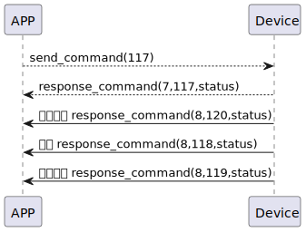

# Finger Get 説明
携帯電話が117コマンドを送信し、指紋情報を取得します。

### 送信フォーマット

|  バイト  |       0 |
|:------:|-------:|
| データ   |  コマンド |
- コマンド: 指令117（固定）

### 受信フォーマット
| バイト  |       2 |   1   |     0      |
|:---:|:-------:|:-----:|:----:|
| データ |  ステータス | コマンド | レスポンス   |
- コマンド: 指令117（固定）
- レスポンス: 応答0x07（固定）
- ステータス: 0x00（成功）

### プッシュフォーマット - 開始
| バイト  |       2 |   1   |  0   |
|:---:|:-------:|:-----:|:----:|
| データ |  ステータス | コマンド | プッシュ   |
- コマンド: 指令120（固定）
- レスポンス: 応答0x08（固定）
- プッシュ: 0x00（成功）

### プッシュフォーマット
| バイト  | N~   2 |   1   |  0   |
|:---:|:------:|:-----:|:----:|
| データ | ペイロード | コマンド | プッシュ |
- コマンド: 指令118（固定）
- プッシュ: 応答0x08（固定）
- ペイロード: ペイロード参照。

##### **ペイロードは以下の通りです**

|  バイト  |     指紋名| 指紋名の長さ| 指紋ID|     0 |
|:------:|:---------:|:--------:|:--------:|:--------:|
| データ   | 指紋名     | 指紋名の長さ |指紋ID|指紋IDの長さ|

### プッシュフォーマット - 終了
| バイト  |       2 |   1   |     0      |
|:---:|:-------:|:-----:|:----:|
| データ |  ステータス | コマンド |プッシュ   |
- コマンド: 指令119（固定）
- レスポンス: 応答0x08（固定）
- プッシュ: 0x00（成功）

### シーケンス図
<!--  -->

### Androidの例
```java
override fun fingerPrints(result: CHResult<CHEmpty>) {
    if (checkBle(result)) return
    sendCommand(SesameOS3Payload(SesameItemCode.SSM_OS3_FINGERPRINT_GET.value, byteArrayOf())) { res ->
        result.invoke(Result.success(CHResultState.CHResultStateBLE(CHEmpty())))
    }
}
