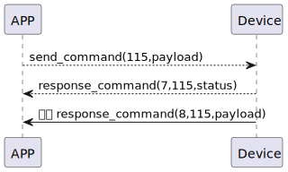

# Finger Change 説明
1. ssm_touchが新しい指紋を追加すると、指紋情報が自動的にアプリにプッシュされます。
2. アプリが新しい指紋の名前を変更すると、123コマンドをssm_touchに送信します。

### 送信フォーマット

|  バイト  |       N~1 |    0     |
|:------:|----------:|:--------:|
| データ   | ペイロード |  コマンド |

- コマンド: 指令123（固定）
- ペイロード: ペイロード表を参照

### 受信フォーマット
| バイト  |        2   |     1     |     0      |
|:---:|:-----------:|:----:|:---------:|
| データ |  ステータス | コマンド |レスポンス   |
- コマンド: 指令123（固定）
- レスポンス: 応答0x07（固定）
  - ステータス: 0x00（成功）

### プッシュフォーマット

| バイト  |          2 |     1     |  0   |
|:---:|:---:|----------:|:----:|
| データ | ペイロード|   コマンド | プッシュ |
- コマンド: 指令123（固定）
- プッシュ: 応答0x08（固定）
- ペイロード: ペイロード表を参照

##### **ペイロードは以下の通りです**

|  バイト  |     パスワード名| パスワード名の長さ| パスワードID|     0 |
|:------:|:---------:|:--------:|:--------:|:--------:|
| データ   | パスワード名     | パスワード名の長さ |パスワードID|パスワードIDの長さ|

### シーケンス図
<!--  -->

### Androidの例
```java
   override fun keyBoardPassCodeChange(ID: String, name: String, result: CHResult<CHEmpty>) {
        if (checkBle(result)) return
        sendCommand(SesameOS3Payload(SesameItemCode.SSM_OS3_PASSCODE_CHANGE.value, byteArrayOf(ID.hexStringToByteArray().size.toByte()) + ID.hexStringToByteArray() + name.toByteArray())) { res ->
            result.invoke(Result.success(CHResultState.CHResultStateBLE(CHEmpty())))
        }
    }
