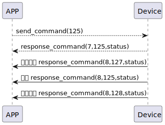

# KeyboardPassword Get 説明
携帯電話が125コマンドを送信して、ssm_touchのパスワードを取得します。

### 送信フォーマット

|  バイト  |       0 |
|:------:|-------:|
| データ   |  コマンド |

- コマンド: 指令125（固定）

### 受信フォーマット

| バイト  |       2 |   1   |     0      |
|:---:|:-------:|:-----:|:----:|
| データ |  ステータス | コマンド |レスポンス   |
- コマンド: 指令125（固定）
- レスポンス: 応答0x07（固定）
- ステータス: 0x00（成功）

### プッシュフォーマット-start

| バイト  |       2 |   1   |  0   |
|:---:|:-------:|:-----:|:----:|
| データ |  ステータス | コマンド | プッシュ |
- コマンド: 指令127（固定）
- プッシュ: 応答0x08（固定）
- ステータス: 0x00（成功）

### プッシュフォーマット

| バイト  | N~   2 |   1   |  0   |
|:---:|:------:|:-----:|:----:|
| データ | ペイロード | コマンド | プッシュ |
- コマンド: 指令125（固定）
- プッシュ: 応答0x08（固定）
- ペイロード: ペイロード表を参照

##### **ペイロードは以下の通りです**

|  バイト  |     パスワード名| パスワード名の長さ| パスワードID|     0 |
|:------:|:---------:|:--------:|:--------:|:--------:|
| データ   | パスワード名     | パスワード名の長さ |パスワードID|パスワードIDの長さ|

### プッシュフォーマット-end

| バイト  |       2 |   1   |     0      |
|:---:|:-------:|:-----:|:----:|
| データ |  ステータス | コマンド |プッシュ   |
- コマンド: 指令128（固定）
- プッシュ: 応答0x08（固定）
- ステータス: 0x00（成功）

### シーケンス図
<!--  -->

### Androidの例
```java
  override fun keyBoardPassCode(result: CHResult<CHEmpty>) {
        if (checkBle(result)) return
        sendCommand(SesameOS3Payload(SesameItemCode.SSM_OS3_PASSCODE_GET.value, byteArrayOf())) { res ->
            result.invoke(Result.success(CHResultState.CHResultStateBLE(CHEmpty())))
        }
    }
