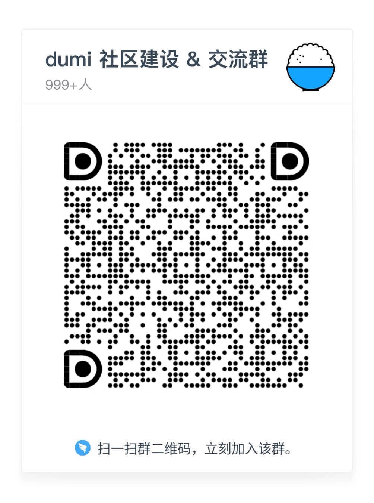

## プロジェクト概要

- SesameSDKは、Androidアプリのためのシンプルで強力な無料のBluetooth/モノのインターネット（IoT）ライブラリです。Sesameの公式アプリもこのSesameSDKを使用して構築されており、Sesameアプリのすべての機能は、このSesameSDK、SesameSDKを使用して実現することができます：

- Sesameデバイスの登録（Sesame 5、Sesame 5 Pro、Sesame Bike2、Sesame BLE Connector1、Sesame open sensor、Sesame Touch 1 Pro、 Sesame Touch 1 、WIFI Module2）
- ロックとアンロック

- 履歴を見る
- 更新 SesameOS3
- SesameOS3 機器の各種設定
- バッテリー残量の取得

#### このプロジェクト SesameOS3 は、主にハードウェアデバイス　Sesame 5、Sesame 5 Pro、Sesame Bike2、Sesame BLE Connector1、Sesame open sensor、Sesame Touch 1 Pro、 Sesame Touch 1 、WIFI Module2 などを解決します。 製品はBluetooth経由で接続されています。 iOSアプリケーションを介してインテリジェントにハードウェアを操作するためにユーザーを支援します。

## Appダウンロードします
#### SesameOS 3.0
- [CANDY HOUSE Official Site](https://jp.candyhouse.co/)
- Sesame app on  [https://apps.apple.com/app/id1532692301/](https://apps.apple.com/app/id1532692301/)
- Sesame app on  [https://testflight.apple.com/join/Rok4GOFD/](https://testflight.apple.com/join/Rok4GOFD/)

#### インストール要件です

* 
* 
*     
* 

## Sesame家族です
<!--  -->

<iframe id="embed_dom" name="embed_dom" frameborder="0" style="display:block;margin-left:10.5px; margin-top:20.5px;width:900px; height:500px;" src="https://www.processon.com/embed/655b2a7bd74c071b761224f1"></iframe>

## フィードバックです

 [フィードバックです](https://github.com/CANDY-HOUSE/Sesame_BluetoothAPI_document/issues/new)

<!-- {width=50% height=auto} -->

