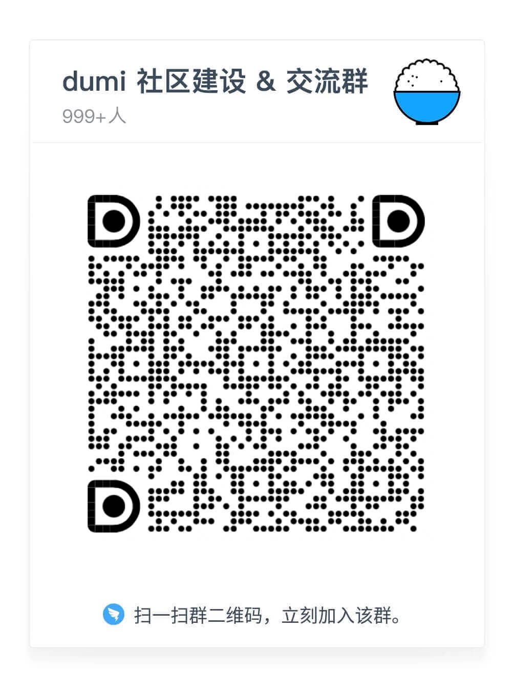

## 什么是Sesame

- SesameSDK 是一个简单、强大且免费的蓝牙/物联网（物联网）库，适用于 iOS & Android 应用程序。Sesame 官方应用程序也是使用这个 SesameSDK 构建的，芝麻应用程序的所有功能都可以通过这个 SesameSDK 实现。SesameSDK 允许您：

- 注册 Sesame 设备（Sesame 5、Sesame 5 Pro、Sesame Bike2、Sesame BLE Connector1、Sesame open sensor、Sesame Touch 1 Pro、 Sesame Touch 1 、WIFI Module2）
- 锁定和解锁
- 获取历史记录
- 更新 SesameOS3
- SesameOS3 设备的各种设置
- 获取电池电量
- 项目 SesameOs3 主要解决硬件设备 Sesame 5、Sesame 5 Pro、Sesame Bike2、Sesame BLE Connector1、Sesame open sensor、Sesame Touch 1 ProCHBluetoothCenter 類別說明、 Sesame Touch 1 、WIFI Module2 等产品通过蓝牙连接。帮助用户通过 iOS 应用软件智能操作硬件。

## App下载 
#### SesameOS 3.0
- [CANDY HOUSE Official Site](https://jp.candyhouse.co/)
- Sesame app on  [https://apps.apple.com/app/id1532692301/](https://apps.apple.com/app/id1532692301/)
- Sesame app on  [https://testflight.apple.com/join/Rok4GOFD/](https://testflight.apple.com/join/Rok4GOFD/)

#### 安装平台要求

* 
* 
*     
* 

## Sesame家族
<!--  -->

<iframe id="embed_dom" name="embed_dom" frameborder="0" style="display:block;margin-left:10.5px; margin-top:20.5px;width:900px; height:500px;" src="https://www.processon.com/embed/655b2a7bd74c071b761224f1"></iframe>

## 问题反馈

 [问题反馈](https://github.com/CANDY-HOUSE/Sesame_BluetoothAPI_document/issues/new)

<!-- {width=50% height=auto} -->

